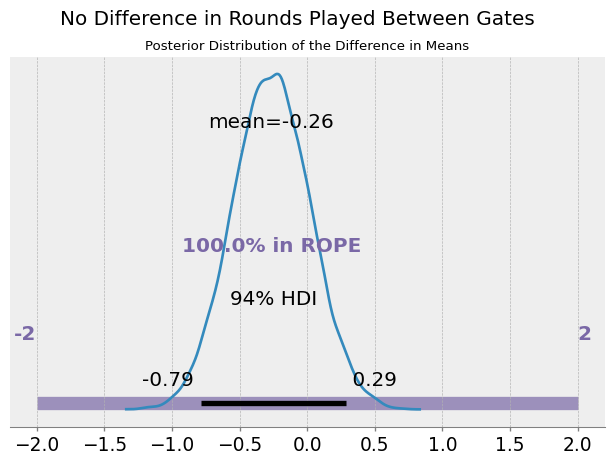

# What is Bayesian A/B Testing
> Bayesian A/B testing is a statistical approach used to compare two variants (A and B) of a product, process, or treatment to determine which one performs better. Unlike traditional frequentist methods that rely on p-values and hypothesis testing, Bayesian A/B testing leverages Bayes’ theorem to update the probability of a hypothesis as more data becomes available. This method provides a more intuitive and flexible framework for decision-making, allowing experimenters to incorporate prior knowledge, quantify uncertainty, and make probabilistic statements about the results. By producing posterior distributions of the metrics of interest, Bayesian A/B testing offers a deeper insight into the effect sizes and their credibility intervals, facilitating more informed and actionable business decisions.

# Business Problem Statement
Cookie Cats, a popular mobile puzzle game developed by Tactile Entertainment, is designed to captivate and engage players through its entertaining gameplay and strategic challenges. One critical aspect of the game’s design is the placement of gates, which are points in the game where players must wait or make in-app purchases to progress. The placement of these gates can significantly influence player retention and overall game engagement.
 
Recently, the game develowpment team at Cookie Cats has hypothesized that relocating the initial gate from level 30 to level 40 may improve player retention and engagement. To test this hypothesis, an A/B test was conducted where new players were randomly assigned to one of two groups: 

1. The control group with the gate at level 30 (gate_30)
2. The experimental group with the gate moved to level 40 (gate_40).

The primary objective of this analysis is to determine whether moving the gate to level 40 has a positive impact on player behavior, specifically focusing on key metrics such as the number of game rounds played within the first 14 days (sum_gamerounds) and retention rates at one day (retention_1) and seven days (retention_7) after installation.

# Results
	Found a -1.3% average uplift in 1-day retention and -4.3% in 7-day retention. No increase in games played.

## Game rounds played

  

- **Posterior difference in mean:** The difference in means is centered around -0.26 with a 94% Highest Density Interval (HDI) from -0.79 to 0.29 game rounds.

- **Effect on game rounds:** The treatment effect on game rounds playes is small and includes 0, indicating no definitive tangible effect. 
- **Region of practical equivalence (ROPE):** 100% of the posterior lies within the ROPE of +/- 2 games, indicating negligible practica impact. 

## Retention 1 and 7

  

- **1 Day Retention:**
  - **Relative uplift of Gate 40:** An average uplift of -1.3% with a 94% HDI from -2.7% to 0%.
  - **ROPE:** 34% of our posterior lies within the ROPE*, suggesting a small negative uplift.   

- **7 Day Retention:**
  - **Relative uplift of Gate 40:** An average uplift of -4.3% with a 94% HDI from -6.8% to -1.8%.
  - **ROPE:** 0.7% of our posterior lies within the ROPE, suggesting a significant negative uplift.   

  *We consider a +/- 1% to be region of practical equivalence.