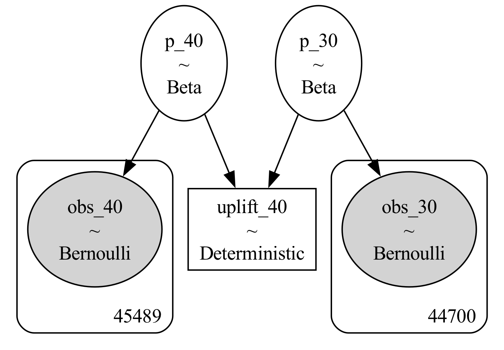

# What is A/B Testing

> A/B testing (also known as split testing) is a process of showing two variants of the same web page to different segments of website visitors at the same time and comparing which variant drives more conversions.

# Business Problem Statement
Cookie Cats, a popular mobile puzzle game developed by Tactile Entertainment, is designed to captivate and engage players through its entertaining gameplay and strategic challenges. One critical aspect of the game’s design is the placement of gates, which are points in the game where players must wait or make in-app purchases to progress. The placement of these gates can significantly influence player retention and overall game engagement.
 
Recently, the game develowpment team at Cookie Cats has hypothesized that relocating the initial gate from level 30 to level 40 may improve player retention and engagement. To test this hypothesis, an A/B test was conducted where new players were randomly assigned to one of two groups: 

1. The control group with the gate at level 30 (gate_30)
2. The experimental group with the gate moved to level 40 (gate_40).

The primary objective of this analysis is to determine whether moving the gate to level 40 has a positive impact on player behavior, specifically focusing on key metrics such as the number of game rounds played within the first 14 days (sum_gamerounds) and retention rates at one day (retention_1) and seven days (retention_7) after installation.

# Data

The data we have is from **90,189 players** that installed the game while the AB-test was running. The variables are:

1. *userid*: A unique number that identifies each player.
2. *version*: Whether the player was put in the control group (gate_30 - a gate at level 30) or the group with the moved gate (gate_40 - a gate at level 40).
3. *sum_gamerounds*: the number of game rounds played by the player during the first 14 days after install.
4. *retention_1*: Did the player come back and play 1 day after installing?
5. *retention_7*: Did the player come back and play 7 days after installing?

# Results

  

# Analysis

## Retention 1 and 7
We first tackle the metrics of `retention_1` and `retention_2`. These can be modeled as *bernoulli conversions*, where the parameter of interest is the user performing an action. In this case, these actions are:

1. rention_1: Did the player come back and play 1 day after installing?
2. rention_7: Did the player come back and play 7 days after installing?

What we want to know is whether `gate_30` is "better" than `gate_40`. Let $\theta_{30}$ and $\theta_{40}$ be the true conversion rates for each version respectively. Then the outcome of whether a player converts (that is, come back to play 1 or 7 day after installing the game) is the random variable $Bernoulli(\theta_{30})$ and $Bernoulli(\theta_{40})$.

  

## How do we Choose Priors?
A prior represents what you believe before you have any evidence. There is often no purely objective basis for choosing a prior; it typically depends on the broader context of the problem. Here are some guidelines for selecting priors:

1. Non-Informative Priors:
    - When to Use: When you have little to no prior knowledge about the parameter.
	- Example: $Beta(1, 1)$ is a non-informative prior for conversion rates, treating all possible values as equally likely.
	- Advantage: Allows the data to predominantly influence the posterior estimates.
2. Weakly Informative Priors:
	- When to Use: When you have some information but want the data to play a dominant role.
	- Example: A $Beta(2, 2)$ prior might slightly guide the analysis towards the center of the distribution without strongly influencing the results.
	- Advantage: Provides slight guidance without overwhelming the data, ensuring that the data still has a significant impact.
3. Informative Priors:
    - When to Use: When you have substantial prior knowledge from past experiments or expert opinions.
    - Example: If previous experiments suggest a conversion rate around 20%, a $Beta(20, 80)$ prior can reflect this knowledge.
    - Advantage: Safeguards against false discoveries and incorporates substantial prior knowledge. However, it may require more data to detect true effects, potentially extending the duration of the test.

### Practical Considerations

- Context and History: If the company has run similar experiments in the past, use this historical data to inform your priors.
- Expert Opinion: Consult with domain experts to establish priors based on their insights and experience.
- Data-Driven Priors: If initial data is available, empirical Bayes methods can be used to estimate the priors directly from the data.

## Setting Priors
Since we cannot know the true conversion rates, we model them using the Beta distribution.

For those familiar with Bayesian inference, this choice is convenient because the Beta distribution is the conjugate prior of the Bernoulli distribution. This allows us to derive the posterior distribution analytically. However, we will still use sampling with PyMC, as it simplifies extending the model with different priors and assumptions.

Given that we lack prior knowledge or context for this problem, we choose a non-informative prior, specifically the $Beta(1, 1)$ distribution. The $Beta(1, 1)$ distribution is also known as the uniform distribution on the interval [0, 1]. Since conversion rates represent the probabilities of players returning to the game, they must lie within this interval. An intuitive explanation for the Beta distribution can be found [here](http://varianceexplained.org/statistics/beta_distribution_and_baseball/).

By using a $Beta(1, 1)$ prior, we ensure that all possible conversion rates are initially considered equally likely, allowing the data to predominantly influence the posterior estimates.