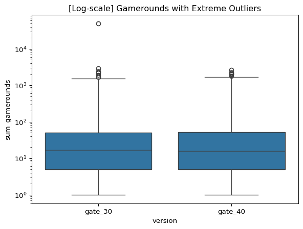
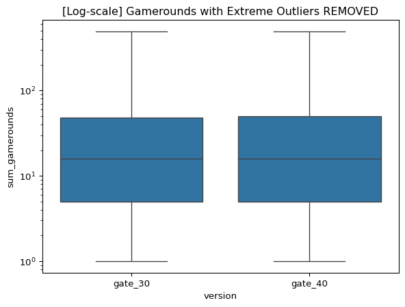

# EDA


``` python
import pandas as pd
import seaborn as sns

pd.options.display.float_format = "{:.2f}".format
```

``` python
data_raw = pd.read_csv("data/cookie_cats.txt")
data = data_raw.melt(
    id_vars=["userid", "version", "sum_gamerounds"],
    value_vars=["retention_1", "retention_7"],
    var_name="retention_type",
    value_name="retained",
)

print(data.info())
```

    <class 'pandas.core.frame.DataFrame'>
    RangeIndex: 180378 entries, 0 to 180377
    Data columns (total 5 columns):
     #   Column          Non-Null Count   Dtype 
    ---  ------          --------------   ----- 
     0   userid          180378 non-null  int64 
     1   version         180378 non-null  object
     2   sum_gamerounds  180378 non-null  int64 
     3   retention_type  180378 non-null  object
     4   retained        180378 non-null  bool  
    dtypes: bool(1), int64(2), object(2)
    memory usage: 5.7+ MB
    None

# Exploratory analysis

``` python
game_rounds_plot = (
    sns.boxplot(
        data=data,
        x="version",
        y="sum_gamerounds",
        log_scale=True,
    )
    .set_title("[Log-scale] Gamerounds with Extreme Outliers")
    .figure.savefig("images/gamerounds_outliers.png", bbox_inches="tight")
)

game_rounds_plot
```



# sum game rounds has some extreme outliers

``` python
data_gate_30 = data[data.version == "gate_30"]
data_gate_40 = data[data.version == "gate_40"]

print("Game rounds Gate 1:")
print(data_gate_30["sum_gamerounds"].describe())
print("--------------------------------------------------------")
print("Game rounds Gate 7:")
print(data_gate_40["sum_gamerounds"].describe())
```

    Game rounds Gate 1:
    count   89400.00
    mean       52.46
    std       256.71
    min         0.00
    25%         5.00
    50%        17.00
    75%        50.00
    max     49854.00
    Name: sum_gamerounds, dtype: float64
    --------------------------------------------------------
    Game rounds Gate 7:
    count   90978.00
    mean       51.30
    std       103.29
    min         0.00
    25%         5.00
    50%        16.00
    75%        52.00
    max      2640.00
    Name: sum_gamerounds, dtype: float64

``` python
print("Gate 30 users with game rounds above the 99th ")
quantile_99 = data_gate_30["sum_gamerounds"].quantile(0.99)
print((data_gate_30[data_gate_30["sum_gamerounds"] > quantile_99].shape[0]))

print("--------------------------------------------------------")
print("Gate 40 users with game rounds above the 99th ")
quantile_99 = data_gate_40["sum_gamerounds"].quantile(0.99)
print((data_gate_40[data_gate_40["sum_gamerounds"] > quantile_99].shape[0]))
```

    Gate 30 users with game rounds above the 99th 
    892
    --------------------------------------------------------
    Gate 40 users with game rounds above the 99th 
    910

``` python
# we remove game rounds above the 99th percentile
quantile_99 = data["sum_gamerounds"].quantile(0.99)
data_no_outliers = data[data["sum_gamerounds"] <= quantile_99]

# %%

game_rounds_plot = (
    sns.boxplot(
        data=data_no_outliers,
        x="version",
        y="sum_gamerounds",
        log_scale=True,
    )
    .set_title("[Log-scale] Gamerounds with Extreme Outliers REMOVED")
    .figure.savefig("images/gamerounds_no_outliers.png", bbox_inches="tight")
)

game_rounds_plot
```



``` python
print(data_no_outliers["sum_gamerounds"].describe())
```

    count   178582.00
    mean        44.53
    std         71.83
    min          0.00
    25%          5.00
    50%         16.00
    75%         49.00
    max        493.00
    Name: sum_gamerounds, dtype: float64

I still think the outliers can be justified to some degree. Whilst a
majority of players play less than 50 rounds in 14 days (about 4 games a
day), players can certainly play more than 4 rounds a day.

On the extreme end 50k rounds in 14 days (~3600 / day) seems excessive,
but by that intuition, is 3k rounds in 14 days (~214/day) unusual?

## Questions to ask stakeholders: Are the numbers at the extreme usual?

``` python
data_no_outliers.to_csv("data/data_no_outliers.csv", index=False)
```
